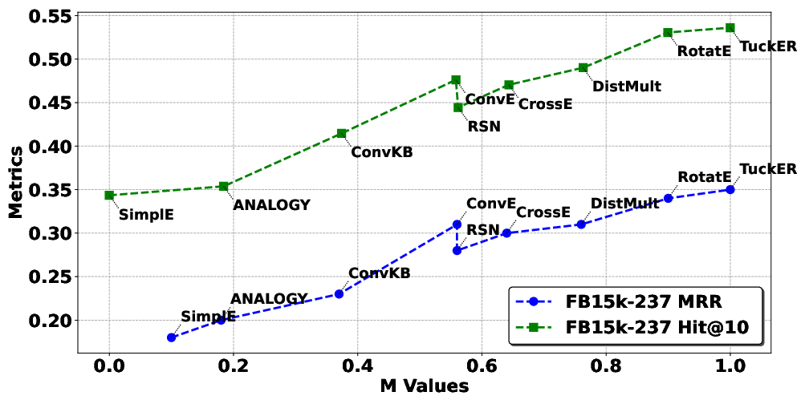
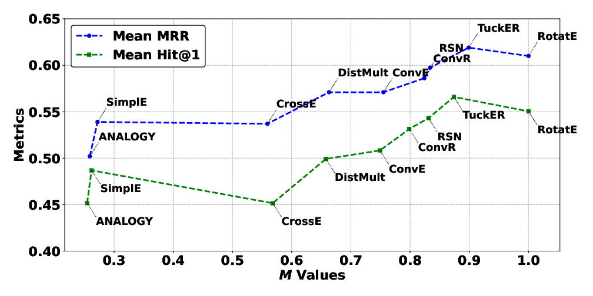

# KG-EDAS: A Meta-Metric Framework for Evaluating Knowledge Graph Completion Models

[](https://www.python.org/)
[](LICENSE)

##  Associated Research Paper

**Title**: KG-EDAS: A Meta-Metric Framework for Evaluating Knowledge Graph Completion Models  
**Authors**: Haji Gul¹, Abdul Ghani Naim¹, Ajaz Ahmad Bhat¹*  
**Affiliation**: School of Digital Science, Universiti Brunei Darussalam  

**Paper Link**: [IEEE Big Data 2025](https://www.computer.org/csdl/proceedings-article/bigdata/2025/11402521/2eDtzuJkX9S)   
**ORCIDs**:  
- Haji Gul: [0000-0002-2227-6564](https://orcid.org/0000-0002-2227-6564)  
- Abdul Ghani Naim: [0000-0002-7778-4961](https://orcid.org/0000-0002-7778-4961)  
- Ajaz Ahmad Bhat: [0000-0002-6992-8224](https://orcid.org/0000-0002-6992-8224)

**Abstract**:  
KGs are often incomplete, missing entities and relations, an issue addressed by Knowledge Graph Completion (KGC) methods that predict missing elements. Mean Reciprocal Rank (MRR), Mean Rank (MR), and Hit@k (e.g., MRR) are commonly used to assess the performance of KGC models. A major challenge in evaluating KGC models however, lies in comparing their performance across multiple datasets and metrics. A model may outperform others on one dataset but underperform on another, making it difficult to determine overall superiority. Moreover, even within a single dataset, different metrics such as MRR and Hit@1 can yield conflicting rankings, where one model excels in MRR while another performs better in Hit@1, further complicating model selection for downstream tasks.  To address this fragmentation, we propose \textbf{KG-EDAS}, Inspired by Inspired by Multi-Criteria Decision-Making (MCDM), \textit{E}valuation based on \textit{D}istance from \textit{A}verage \textit{S}olution (EDAS), a robust meta-metric that synthesizes model performance across multiple datasets and diverse evaluation criteria into a single normalized score ($M_i \in [0,1]$). Experiments on five standard datasets show that KG-EDAS produces stable, interpretable rankings highly correlated with MRR ($\rho=0.93$) while resolving conflicts across metrics. In addition, it integrates multi-metric, multi-dataset performance into a unified ranking, offering a consistent, robust, and generalizable framework that resolves conflicting rankings and supports informed model selection in real-world KGC applications. We argue that KG-EDAS offers a principled foundation for standardized evaluation in KGC—enabling fair comparisons and supporting automated model selection.

### Keywords: Knowledge Graph Embedding, Link Prediction, Evaluation Metrics, Multi-criteria Decision Making, Model Ranking, Performance Aggregation


## Structure

#
KG-EDAS/  
├── dataloader.py  
├── edas.py  
├── utils.py  
├── main.py  
├── tail_prediction_results.csv          # Example input (tail prediction)  
├── README.md  
├── paper/  
│   ├── IEEE_BigData__KG_EDAS_.pdf       # Full paper  
│── Figure1.png                     
└── outputs/                             # Generated results (gitignored)  

---


## Install Dependencies  

### 1. Clone the Repository

```bash
git clone https://github.com/hajigul/KG-EDAS.git
cd KG-EDAS
```

Recommended: Use a virtual environment  
python -m venv venv

# Activate virtual environment  
# Windows: 
```bash
venv\Scripts\activate
```
# Linux/macOS:  
```bash
source venv/bin/activate  
```
# Install requirements  
```bash
pip install -r requirements.txt  
```

# Run  
```bash  
python main.py  
```

# Output:  

## KG-EDAS Ranking Results  
After applying the **KG-EDAS** meta-metric, we computed a unified score **M** (∈ [0, 1]) for each model by aggregating its performance across multiple datasets and evaluation metrics (MR, MRR, Hit@1, Hit@10). The final **M** score balances the positive and negative deviations from the average performance, providing a robust and interpretable ranking that resolves conflicts often seen in traditional metrics.

### Key Outcome:
- **RotatE** achieved the highest EDAS score (**M = 0.998**) and secured **Rank 1**.
- The ranking effectively integrates performance from five benchmark datasets: **FB15k**, **WN18**, **FB15k-237**, **WN18RR**, and **YAGO3-10**.

**Table: Link prediction results on FB15k, WN18, FB15k-237, WN18RR, and YAGO3-10.  

| Models     | FB15k MR | FB15k MRR | FB15k H@1 | FB15k H@10 | WN18 MR | WN18 MRR | WN18 H@1 | WN18 H@10 | FB15k-237 MR | FB15k-237 MRR | FB15k-237 H@1 | FB15k-237 H@10 | WN18RR MR | WN18RR MRR | WN18RR H@1 | WN18RR H@10 | YAGO3-10 MR | YAGO3-10 MRR | YAGO3-10 H@1 | YAGO3-10 H@10 | **M**   | **Rank** |
|------------|----------|-----------|-----------|------------|---------|----------|----------|-----------|--------------|---------------|---------------|----------------|-----------|------------|------------|-------------|-------------|--------------|--------------|---------------|---------|----------|
| **RotatE**     | 42      | 0.791    | 0.739    | 0.881     | 274    | 0.949   | 0.943   | 0.960    | 178         | 0.336        | 0.238        | 0.531         | 3318     | 0.475     | 0.426     | 0.573      | 1827       | 0.498       | 0.405       | 0.671        | **0.998** | **1**    |
| **TuckER**     | 39      | 0.788    | 0.729    | 0.889     | 510    | 0.951   | 0.946   | 0.958    | 162         | 0.352        | 0.259        | 0.536         | 6239     | 0.459     | 0.430     | 0.514      | 2417       | 0.544       | 0.466       | 0.681        | **0.925** | **2**    |
| RSN        | 70      | 0.773    | 0.706    | 0.886     | 471    | 0.950   | 0.946   | 0.959    | 251         | 0.346        | 0.256        | 0.526         | 5646     | 0.467     | 0.437     | 0.527      | 2582       | 0.527       | 0.446       | 0.673        | 0.854   | 3        |
| ConvR      | 51      | 0.777    | 0.723    | 0.870     | 346    | 0.928   | 0.912   | 0.951    | 248         | 0.280        | 0.198        | 0.444         | 4210     | 0.395     | 0.346     | 0.483      | 1339       | 0.511       | 0.427       | 0.664        | 0.814   | 4        |
| ConvE      | 51      | 0.688    | 0.595    | 0.849     | 413    | 0.945   | 0.939   | 0.957    | 281         | 0.305        | 0.219        | 0.476         | 4944     | 0.427     | 0.390     | 0.508      | 2429       | 0.488       | 0.399       | 0.658        | 0.746   | 5        |
| DistMult   | 173     | 0.784    | 0.736    | 0.863     | 675    | 0.824   | 0.726   | 0.946    | 199         | 0.313        | 0.224        | 0.490         | 5913     | 0.433     | 0.397     | 0.502      | 1107       | 0.501       | 0.413       | 0.661        | 0.679   | 6        |
| CrossE     | 136     | 0.702    | 0.601    | 0.862     | 441    | 0.834   | 0.733   | 0.950    | 227         | 0.298        | 0.212        | 0.470         | 5212     | 0.405     | 0.381     | 0.450      | 3839       | 0.446       | 0.331       | 0.654        | 0.551   | 7        |
| SimplE     | 138     | 0.726    | 0.661    | 0.836     | 759    | 0.938   | 0.933   | 0.946    | 651         | 0.179        | 0.100        | 0.344         | 8764     | 0.398     | 0.383     | 0.427      | 2849       | 0.453       | 0.358       | 0.632        | 0.299   | 8        |
| ANALOGY    | 126     | 0.726    | 0.656    | 0.837     | 808    | 0.934   | 0.926   | 0.944    | 476         | 0.202        | 0.126        | 0.354         | 9266     | 0.366     | 0.358     | 0.380      | 2423       | 0.283       | 0.192       | 0.457        | 0.258   | 9        |
| TorusE     | 143     | 0.746    | 0.689    | 0.840     | 525    | 0.947   | 0.943   | 0.954    | 211         | 0.281        | 0.196        | 0.447         | 4873     | 0.463     | 0.427     | 0.534      | 19455      | 0.342       | 0.274       | 0.474        | 0.234   | 10       |


## Robustness Analysis  
To evaluate the stability and robustness of **KG-EDAS**, we conducted an ablation study by sequentially removing individual metrics (MRR, MR, and Hit@1) and recomputing the model rankings. The results show that KG-EDAS produces highly consistent rankings even when key metrics are excluded, demonstrating its resilience to variations in evaluation criteria.

### Table: Model Ranking Analysis After Removing Individual Metrics

| Model      | Original Rank | Removed MRR | Removed MR | Removed Hit@1 | Max Change |
|------------|---------------|-------------|------------|---------------|------------|
| **RotatE**     | 1             | 1           | 3          | 1             | **2**      |
| **TuckER**     | 2             | 2           | 1          | 2             | 1          |
| **ConvR**      | 3             | 3           | 2          | 3             | 1          |
| **ConvE**      | 4             | 4           | 5          | 4             | 1          |
| **DistMult**   | 5             | 5           | 4          | 5             | 1          |
| CrossE     | 6             | 6           | 6          | 6             | 0          |
| SimplE     | 7             | 7           | 7          | 7             | 0          |
| ANALOGY    | 8             | 8           | 8          | 8             | 0          |

**Observation**: Most models show minimal rank changes (maximum shift of only 2 positions), confirming that KG-EDAS provides stable and reliable rankings even under partial metric removal.


## Figure 1 from the Paper  
**Figure 1**: Comparison of prediction metrics across datasets. The left image shows the relation prediction $(h, ?, t)$ comparison of **mean MRR** and **EDAS $M$** values across datasets: FB15k-237, FB15k, WN18, WN18RR, and YAGO3-10.  The second image shows the comparison of **mean Hit@1** and **EDAS $M$-values**.






## Citation

@INPROCEEDINGS{11402521,
  author    = {Gul, Haji and Naim, Abdul Ghani and Bhat, Ajaz Ahmad},
  booktitle = {2025 IEEE International Conference on Big Data (BigData)},
  title     = {{KG-EDAS: A Meta-Metric Framework for Evaluating Knowledge Graph Completion Models}},
  year      = {2025},
  pages     = {2823-2832},
  doi       = {10.1109/BigData66926.2025.11402521},
  url       = {https://doi.ieeecomputersociety.org/10.1109/BigData66926.2025.11402521},
  publisher = {IEEE Computer Society},
  address   = {Los Alamitos, CA, USA},
  month     = {Dec}
}


